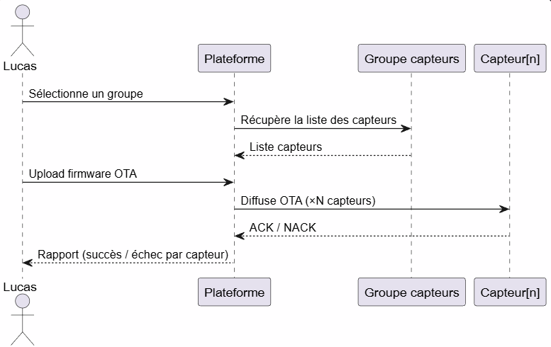
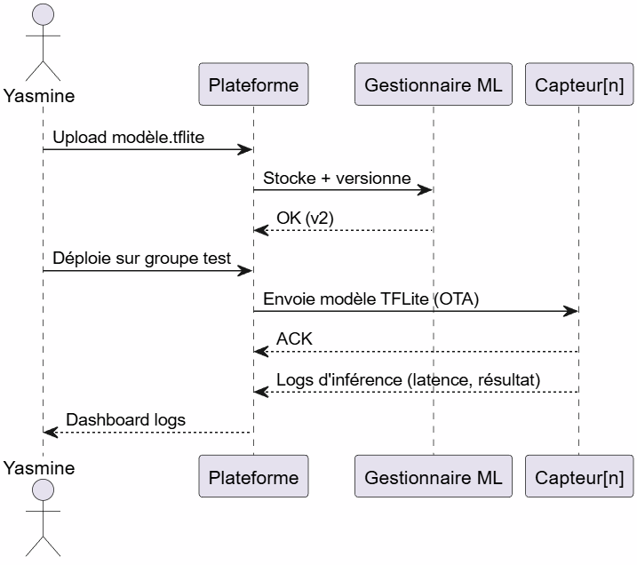

# Persona 1 — Lucas Ferreira
## Ingénieur IoT

---

### Identité

| Champ       | Valeur                        |
|-------------|-------------------------------|
| Prénom/Nom  | Lucas Ferreira                |
| Âge         | 32 ans                        |
| Fonction    | Ingénieur IoT                 |
| Niveau info | ★★★★★ Expert                  |

---

### Contexte

Lucas configure et déploie des capteurs intelligents sur la plateforme. Il gère l'inventaire des capteurs (température, pression, vibration, qualité d'air), leur configuration à distance et les mises à jour firmware OTA. Il maîtrise les protocoles MQTT et CoAP et a besoin d'agir efficacement sur des groupes de capteurs.

---

### Objectifs

- Configurer les capteurs à distance (paramètres, fréquence, seuils d'alerte)
- Déployer des mises à jour firmware OTA
- Surveiller la connectivité et la santé réseau des capteurs
- Gérer l'inventaire des capteurs (groupes, tags)

---

### Besoins

- Configuration en masse sur des groupes de capteurs
- Suivi des mises à jour OTA (avancement, succès, échec)
- Logs réseau exportables
- Gestion de la consommation énergétique (sleep modes)

---

### Points de friction

- Pas d'actions en masse sur un groupe de capteurs
- Logs OTA insuffisants en cas d'échec
- Manque de visibilité sur la connectivité réseau

---

### Scénario type

```
Matin   Configure un groupe de capteurs de vibration à distance :
        paramètres, fréquence d'échantillonnage, seuils d'alerte.

Midi    Pousse une mise à jour firmware OTA sur le groupe.
        Suit l'avancement capteur par capteur.

Après   Un capteur perd la connectivité.
        Consulte les logs réseau pour identifier le problème.
```

---

### Citation

> "Je veux configurer 100 capteurs aussi vite qu'un seul."

## Diagramme de séquence — Déploiement OTA


# Persona 2 — Yasmine Benali
## Data Scientist

---

### Identité

| Champ       | Valeur                              |
|-------------|-------------------------------------|
| Prénom/Nom  | Yasmine Benali                      |
| Âge         | 29 ans                              |
| Fonction    | Data Scientist                      |
| Niveau info | ★★★★☆ Avancé                        |

---

### Contexte

Yasmine développe des algorithmes edge déployés directement sur les capteurs intelligents. Elle entraîne des modèles de détection d'anomalies, les convertit en TFLite (<100 KB) et les uploade sur la plateforme pour déploiement. Elle a besoin de visibilité sur l'exécution réelle des modèles et d'accès aux données brutes des capteurs pour l'entraînement.

---

### Objectifs

- Uploader et versionner des modèles ML (TFLite) sur la plateforme
- Déployer un modèle sur un groupe de capteurs
- Analyser la dérive statistique des capteurs (détection de dérive)
- Accéder aux historiques de valeurs des capteurs pour l'entraînement

---

### Besoins

- Gestionnaire de modèles ML : upload, versioning, rollback, contrôle de taille
- Logs d'inférence edge : résultat, latence d'exécution
- Export de séries temporelles brutes (historique des valeurs)
- Visualisation de la dérive des capteurs (détection de dérive)
- Déclenchement d'une auto-calibration si dérive détectée

---

### Points de friction

- Impossible de savoir si le modèle s'exécute réellement sur le capteur
- Pas de logs d'inférence locale disponibles
- Aucun outil de visualisation de dérive statistique dans l'interface

---

### Scénario type

```
Matin   Exporte l'historique de valeurs de capteurs de vibration.
        Entraîne un modèle de détection d'anomalies, le convertit en TFLite.

Après   Uploade le modèle sur la plateforme, le déploie sur un groupe test.
        Consulte les logs d'inférence pour vérifier l'exécution edge.

Fin     Un capteur montre une dérive.
        Utilise le graphique détection de dérive pour la confirmer.
        Déclenche une auto-calibration.
```

---

### Citation

> "Mon modèle fait moins de 80 KB — j'ai juste besoin de savoir qu'il tourne vraiment sur le capteur."

---

## Diagramme de séquence — Déploiement et vérification d'un modèle ML

