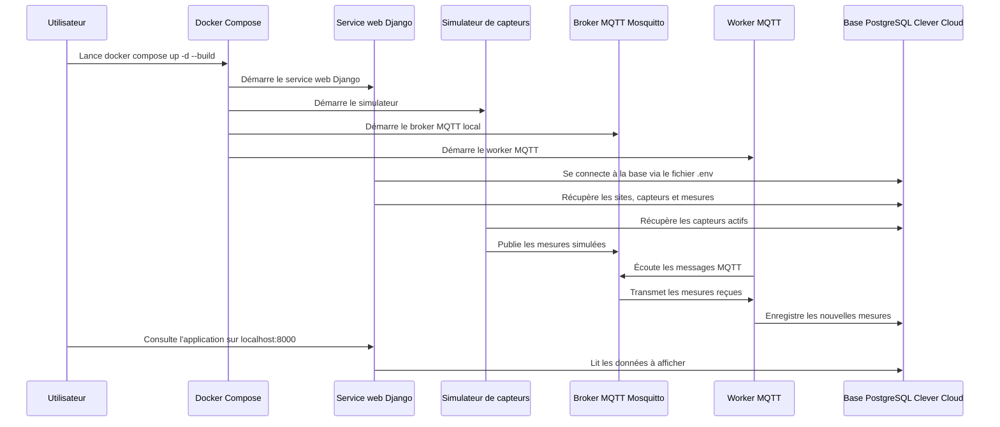

# Guide d'installation

## Projet SAE — Gestion de capteurs intelligents

**Auteurs :** <br>
Anna Maria LIMA DA SILVA<br>
Badice ABDESLAM<br>
Chahd SAMADI<br>
Sofia BEN
  
**Année universitaire :** 2025–2026  

---

## Table des matières

- [Guide d'installation](#guide-dinstallation)
  - [Projet SAE — Gestion de capteurs intelligents](#projet-sae--gestion-de-capteurs-intelligents)
  - [Table des matières](#table-des-matières)
  - [1. Introduction](#1-introduction)
  - [2. Prérequis](#2-prérequis)
  - [3. Vérification des prérequis](#3-vérification-des-prérequis)
    - [Vérifier Git](#vérifier-git)
    - [Vérifier Docker](#vérifier-docker)
    - [Vérifier Docker Compose](#vérifier-docker-compose)
  - [4. Installation de Docker Desktop](#4-installation-de-docker-desktop)
    - [Windows](#windows)
    - [macOS](#macos)
    - [Linux](#linux)
  - [5. Récupération du projet](#5-récupération-du-projet)
  - [6. Configuration du fichier `.env`](#6-configuration-du-fichier-env)
  - [7. Lancement du projet avec Docker Compose](#7-lancement-du-projet-avec-docker-compose)
  - [8. Initialisation de Django](#8-initialisation-de-django)
    - [Création d'un superutilisateur](#création-dun-superutilisateur)
  - [9. Utilisation de la base de données Clever Cloud](#9-utilisation-de-la-base-de-données-clever-cloud)
  - [10. Accès à l'application](#10-accès-à-lapplication)
  - [11. Fonctionnement général du projet](#11-fonctionnement-général-du-projet)
  - [12. Vérification du bon fonctionnement](#12-vérification-du-bon-fonctionnement)
    - [Vérifier les conteneurs](#vérifier-les-conteneurs)
    - [Vérifier les logs de Django](#vérifier-les-logs-de-django)
    - [Vérifier les logs du broker MQTT](#vérifier-les-logs-du-broker-mqtt)
    - [Vérifier les logs du simulateur](#vérifier-les-logs-du-simulateur)
    - [Vérifier les logs du worker MQTT](#vérifier-les-logs-du-worker-mqtt)
  - [13. Commandes utiles](#13-commandes-utiles)
  - [14. Outils recommandés](#14-outils-recommandés)
  - [15. Dépannage](#15-dépannage)
    - [Docker n'est pas lancé](#docker-nest-pas-lancé)
    - [Le fichier `.env` est absent ou incorrect](#le-fichier-env-est-absent-ou-incorrect)
    - [Le port 8000 est déjà utilisé](#le-port-8000-est-déjà-utilisé)
    - [Les données ne s'affichent pas](#les-données-ne-saffichent-pas)
    - [Les mesures MQTT ne sont pas enregistrées](#les-mesures-mqtt-ne-sont-pas-enregistrées)
  

---

## 1. Introduction

Ce guide explique comment installer, configurer et lancer le projet **Gestion de capteurs intelligents**.

Le projet est une application web développée avec **Django**. Il permet de gérer des capteurs, de simuler l'envoi de mesures, de transmettre ces mesures avec **MQTT**, puis de les enregistrer dans une base de données **PostgreSQL hébergée sur Clever Cloud**.

Contrairement à une installation Django classique, ce projet utilise **Docker Compose**.  
Il n'est donc pas nécessaire d'installer manuellement Django avec `pip` ni de créer un environnement virtuel Python avec `venv`.

Les principaux services utilisés sont :

- **Django** : application web principale ;
- **PostgreSQL sur Clever Cloud** : base de données distante ;
- **Mosquitto** : broker MQTT local ;
- **Worker MQTT** : service qui reçoit les messages MQTT et les enregistre en base ;
- **Simulateur de capteurs** : service qui génère et publie des mesures ;
- **Docker Compose** : outil permettant de lancer tous les services.

---

## 2. Prérequis

Avant de lancer le projet, il faut avoir les éléments suivants installés ou disponibles :

- **Git** ;
- **Docker Desktop** ;
- **Docker Compose** ;
- un éditeur de code, par exemple **VS Code** ;
- le fichier `.env` contenant les paramètres de connexion à Clever Cloud ;
- une connexion Internet pour accéder à la base de données distante.

> Important : Docker Desktop doit être ouvert avant de lancer le projet.

---

## 3. Vérification des prérequis

### Vérifier Git

```bash
git --version
```

Si Git est installé, une version doit s'afficher.

### Vérifier Docker

```bash
docker --version
```

Si Docker est installé, une version doit s'afficher.

### Vérifier Docker Compose

```bash
docker compose version
```

Si Docker Compose est disponible, une version doit s'afficher.

---

## 4. Installation de Docker Desktop

### Windows

1. Télécharger Docker Desktop depuis le site officiel de Docker.
2. Lancer l'installateur.
3. Redémarrer l'ordinateur si nécessaire.
4. Ouvrir Docker Desktop.
5. Attendre que Docker soit complètement démarré.

### macOS

1. Télécharger Docker Desktop pour macOS.
2. Installer l'application.
3. Ouvrir Docker Desktop.
4. Vérifier que Docker est actif.

### Linux

Sur Linux, Docker peut être installé avec le gestionnaire de paquets de la distribution utilisée.

Après installation, vérifier le fonctionnement avec :

```bash
docker --version
docker compose version
```

---

## 5. Récupération du projet

Ouvrir un terminal dans le dossier où le projet doit être installé, puis lancer :

```bash
git clone URL_DU_DEPOT
```

Ensuite, entrer dans le dossier du projet :

```bash
cd projet-34-gestion-de-capteurs-intelligents
```

Il faut remplacer `URL_DU_DEPOT` par l'adresse réelle du dépôt Git.

---

## 6. Configuration du fichier `.env`

Le projet utilise un fichier `.env` pour stocker les paramètres de configuration.

Ce fichier doit être placé à la racine du projet, au même niveau que :

```text
manage.py
docker-compose.yml
```

Le fichier `.env` permet notamment à Django de se connecter à la base PostgreSQL distante hébergée sur Clever Cloud.

Exemple de structure du fichier `.env` :

```env
DJANGO_SECRET_KEY=cle_secrete_du_projet
DEBUG=True
ALLOWED_HOSTS=localhost,127.0.0.1,0.0.0.0,web

POSTGRES_DB=nom_de_la_base
POSTGRES_USER=utilisateur
POSTGRES_PASSWORD=mot_de_passe
POSTGRES_HOST=adresse_du_serveur_clever_cloud
POSTGRES_PORT=5432
POSTGRES_SSLMODE=require

MQTT_BROKER_HOST=mqtt
MQTT_BROKER_PORT=1883
MQTT_TOPIC=sensors/+/+/telemetry
```

Les valeurs réelles ne doivent pas être partagées publiquement.

Si le fichier `.env` est absent ou incorrect, l'application Django ne pourra pas récupérer les données depuis Clever Cloud.

---

## 7. Lancement du projet avec Docker Compose

Une fois Docker Desktop ouvert et le fichier `.env` configuré, lancer le projet avec :

```bash
docker compose up -d --build
```

Cette commande permet de :

- construire l'image Docker du projet ;
- lancer l'application Django ;
- lancer le broker MQTT Mosquitto ;
- lancer le worker MQTT ;
- lancer le simulateur de capteurs.

Pour vérifier que les conteneurs sont lancés :

```bash
docker compose ps
```

Les services principaux attendus sont :

```text
web
mqtt
mqtt_worker
sensor_sim
```

---

## 8. Initialisation de Django

Après le lancement des services, il faut appliquer les migrations Django si nécessaire.

```bash
docker compose exec web python manage.py migrate
```

Cette commande permet de créer ou mettre à jour les tables utilisées par Django dans la base PostgreSQL.

### Création d'un superutilisateur

Pour accéder à l'interface d'administration Django, créer un superutilisateur :

```bash
docker compose exec web python manage.py createsuperuser
```

Django demande ensuite :

```text
Username:
Email address:
Password:
Password again:
```

Si un compte administrateur existe déjà, cette étape n'est pas obligatoire.

---

## 9. Utilisation de la base de données Clever Cloud

Dans la version finale du projet, les données principales sont déjà présentes dans une base PostgreSQL hébergée sur **Clever Cloud**.

Cette base contient notamment :

- les sites ;
- les types de capteurs ;
- les capteurs ;
- les seuils ;
- les mesures déjà enregistrées ;
- les alertes éventuelles.

Le projet ne crée donc pas une base PostgreSQL locale avec Docker.

Le rôle du fichier `.env` est de permettre à Django de se connecter à cette base distante.

## 10. Accès à l'application

Une fois le projet lancé, ouvrir un navigateur et accéder à :

```text
http://localhost:8000/
```

L'interface d'administration Django est disponible à l'adresse :

```text
http://localhost:8000/admin/
```

Pages utiles du projet :

```text
http://localhost:8000/capteurs/
http://localhost:8000/sites/
```

---

## 11. Fonctionnement général du projet

Le fonctionnement général du projet peut être représenté de la façon suivante :




Explication du flux :

1. Docker Compose lance les services du projet.
2. Django se connecte à la base PostgreSQL Clever Cloud avec le fichier `.env`.
3. Le simulateur récupère les capteurs actifs depuis la base.
4. Le simulateur publie des mesures sur le broker MQTT local.
5. Le worker MQTT reçoit les messages publiés.
6. Le worker enregistre les nouvelles mesures dans la base Clever Cloud.
7. L'application web affiche les données récupérées depuis la base.

---

## 12. Vérification du bon fonctionnement

### Vérifier les conteneurs

```bash
docker compose ps
```

Les services doivent être en cours d'exécution.

### Vérifier les logs de Django

```bash
docker compose logs -f web
```

Cette commande permet de vérifier que le serveur Django fonctionne correctement.

### Vérifier les logs du broker MQTT

```bash
docker compose logs -f mqtt
```

Cette commande permet de vérifier que Mosquitto est lancé.

### Vérifier les logs du simulateur

```bash
docker compose logs -f sensor_sim
```

Le simulateur doit publier régulièrement des mesures.

### Vérifier les logs du worker MQTT

```bash
docker compose logs -f mqtt_worker
```

Le worker doit recevoir les messages MQTT et enregistrer les mesures dans la base.

---

## 13. Commandes utiles

| Action | Commande | Utilisation |
|---|---|---|
| Cloner le projet | `git clone URL_DU_DEPOT` | Récupérer le code source. |
| Entrer dans le dossier | `cd projet-34-gestion-de-capteurs-intelligents` | Se placer dans le projet. |
| Lancer le projet | `docker compose up -d --build` | Construire et lancer tous les services. |
| Lancer sans reconstruire | `docker compose up -d` | Redémarrer le projet plus rapidement. |
| Voir les conteneurs | `docker compose ps` | Vérifier l'état des services. |
| Voir tous les logs | `docker compose logs -f` | Suivre tous les services. |
| Logs Django | `docker compose logs -f web` | Vérifier le serveur web. |
| Logs MQTT | `docker compose logs -f mqtt` | Vérifier le broker Mosquitto. |
| Logs worker | `docker compose logs -f mqtt_worker` | Vérifier la réception et l'enregistrement des mesures. |
| Logs simulateur | `docker compose logs -f sensor_sim` | Vérifier la publication des mesures. |
| Migrations | `docker compose exec web python manage.py migrate` | Mettre à jour la base. |
| Superutilisateur | `docker compose exec web python manage.py createsuperuser` | Créer un compte admin. |
| Arrêter le projet | `docker compose down` | Arrêter les conteneurs. |
| Redémarrer | `docker compose restart` | Redémarrer les services. |

---

## 14. Outils recommandés

| Outil | Utilisation |
|---|---|
| VS Code | Lire, modifier et organiser le code du projet. |
| Docker Desktop | Lancer les services du projet. |
| Git | Cloner et mettre à jour le projet. |
| Navigateur web | Accéder à l'application Django. |
| Django Admin | Vérifier les capteurs, sites, mesures et alertes. |
| Clever Cloud | Héberger et consulter la base PostgreSQL distante. |

---

## 15. Dépannage

### Docker n'est pas lancé

Erreur possible :

```text
Cannot connect to the Docker daemon
```

Solution :

- ouvrir Docker Desktop ;
- attendre que Docker soit complètement démarré ;
- relancer la commande.

### Le fichier `.env` est absent ou incorrect

Erreur possible :

```text
django.db.utils.OperationalError
```

Solution :

- vérifier que le fichier `.env` est à la racine du projet ;
- vérifier les variables `POSTGRES_DB`, `POSTGRES_USER`, `POSTGRES_PASSWORD`, `POSTGRES_HOST` et `POSTGRES_PORT` ;
- vérifier que `POSTGRES_SSLMODE=require` est présent si Clever Cloud l'exige.

### Le port 8000 est déjà utilisé

Erreur possible :

```text
port is already allocated
```

Solution :

Modifier le port dans `docker-compose.yml` :

```yaml
ports:
  - "8001:8000"
```

L'application sera alors accessible sur :

```text
http://localhost:8001/
```

### Les données ne s'affichent pas

Causes possibles :

- le fichier `.env` ne pointe pas vers la bonne base Clever Cloud ;
- les migrations n'ont pas été appliquées ;
- le worker MQTT n'est pas lancé ;
- le simulateur ne publie pas de mesures.

Commandes utiles :

```bash
docker compose ps
docker compose logs -f web
docker compose logs -f mqtt_worker
docker compose logs -f sensor_sim
```

### Les mesures MQTT ne sont pas enregistrées

Causes possibles :

- le worker MQTT ne reçoit pas les messages ;
- le capteur concerné n'existe pas ou n'est pas actif dans la base ;
- le topic MQTT n'est pas correct ;
- la connexion à Clever Cloud ne fonctionne pas.

Vérification :

```bash
docker compose logs -f mqtt_worker
```
